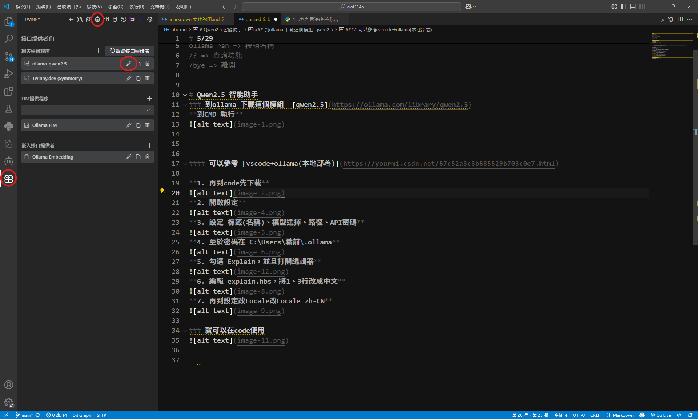

# 5/29
下載 [ollama](https://ollama.com/)
- 到官網尋找模型
  - ollama list => 查詢模型
  - ollama ran => 模組名稱
  - /? => 查詢功能
  - /bye => 離開
---
# Qwen2.5 智能助手
### 到ollama 下載這個模組  [qwen2.5](https://ollama.com/library/qwen2.5)
**到CMD 執行**

---
#### 可以參考 [vscode+ollama(本地部署)](https://yourmi.csdn.net/67c52a3c3b685529b703c0e7.html)

**1. 再到code先下載**

**2. 開啟設定**

**3. 設定 標籤(名稱)、模型選擇、路徑、API密碼**

**4. 至於密碼在 C:\Users\職前\.ollama**

**5. 勾選 Explain，並且打開編輯器**

**6. 編輯 explain.hbs，將1、3行改成中文**

**7. 再到設定改Locale改Locale zh-CN**

### 就可以在code使用(右鍵)

---