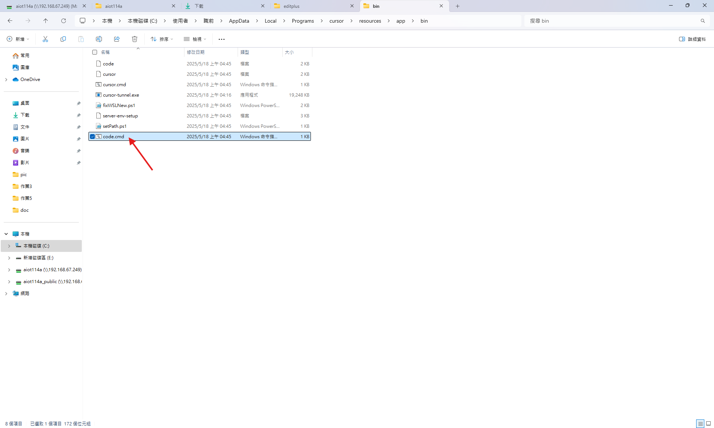
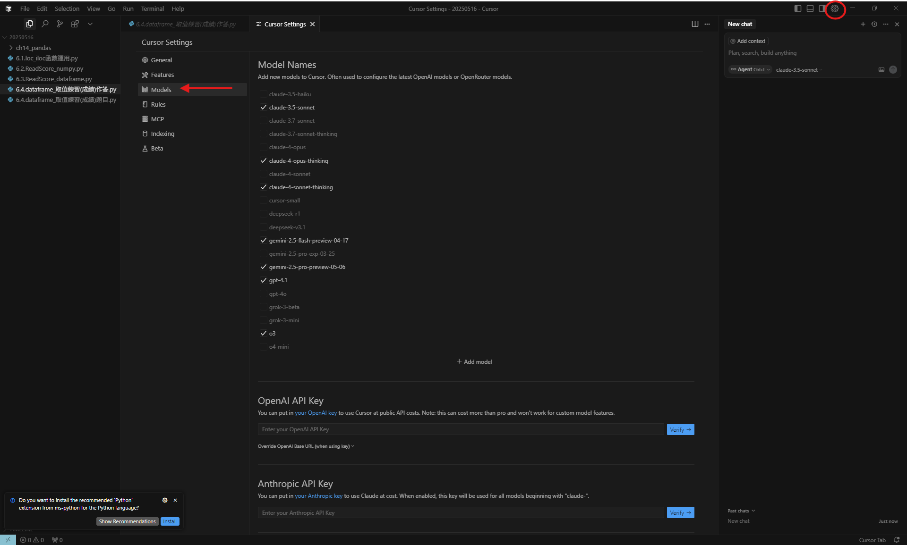
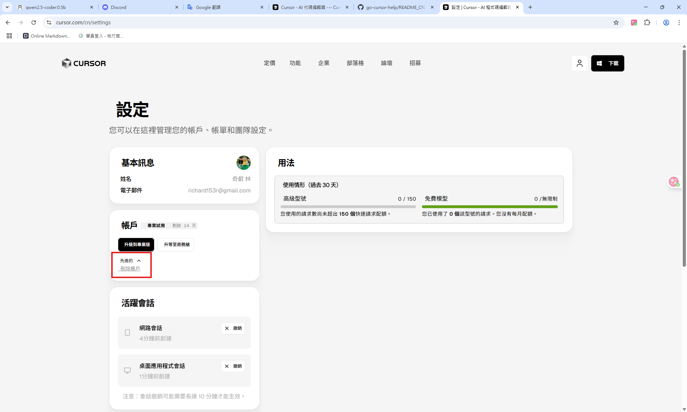
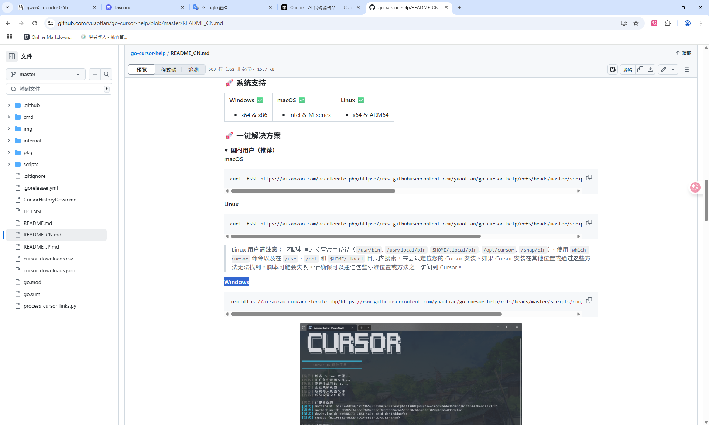
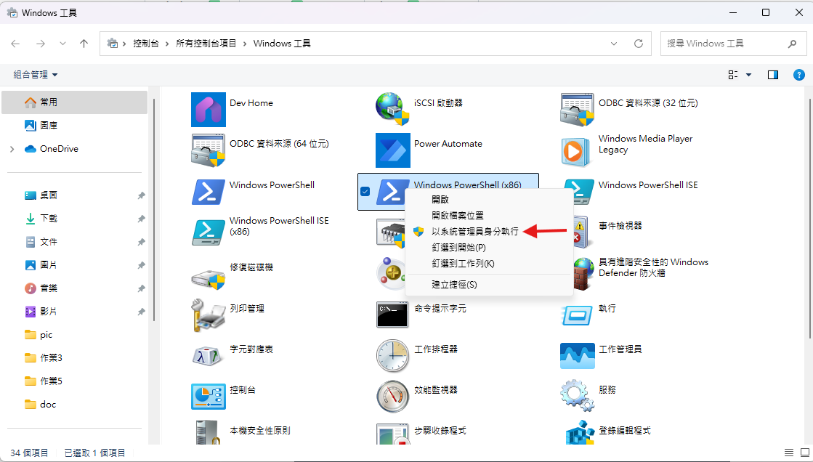

# [cursor](https://www.cursor.com/cn) 應用

**刪掉 code.cmd**
路徑：C:\Users\職前\AppData\Local\Programs\cursor\resources\app\bin

**新增模組**

---
# 將 cursor 用量重置
1. **先到cursor網站刪除帳戶**

2. **再到 [cursor破解網站](https://github.com/yuaotian/go-cursor-help) 點 README_CN.md <中文介面> 下滑到 一鍵解決方案**

3. **在windows工具 用管理員身分開啟 Windows PowerShell(x86) 將指令貼上即可**
